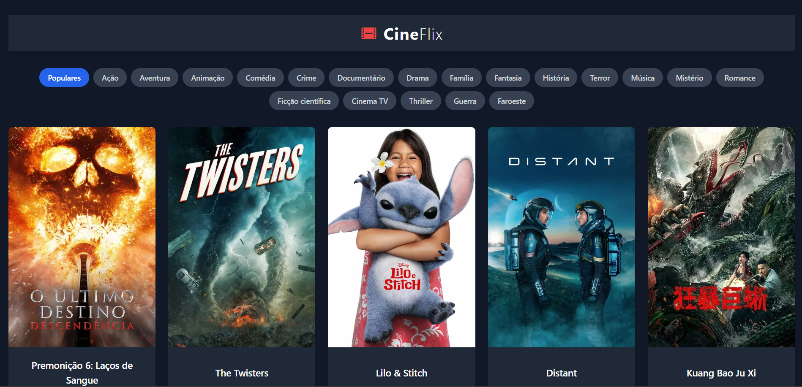

# 🎬 CineFlix - Explorador de Filmes

Uma aplicação web para explorar filmes populares e filtrar por gênero, construída com React e consumindo a API do The Movie Database (TMDb).



---

## 🚀 Sobre o Projeto

Este é um projeto de estudo desenvolvido para praticar conceitos fundamentais de React, como componentização, gerenciamento de estado com Hooks (`useState`, `useEffect`), consumo de APIs e roteamento com React Router. 

A aplicação permite que o usuário visualize filmes populares, filtre por diferentes categorias e veja detalhes específicos de cada filme. O objetivo foi criar uma interface limpa e funcional, seguindo boas práticas de organização de código e estilização moderna.

---

## ✨ Funcionalidades

- **Visualização de Filmes:** Exibição dos filmes mais populares na página inicial.
- **Filtro por Gênero:** Filtro dinâmico que permite ao usuário listar filmes por categorias como Ação, Comédia, Drama, etc.
- **Página de Detalhes:** Rota dedicada para cada filme, mostrando informações detalhadas como sinopse, data de lançamento e gêneros.
- **Layout Responsivo:** Interface adaptável a diferentes tamanhos de tela.
- **Estrutura Organizada:** Código separado em componentes, páginas e serviços para facilitar a manutenção.

---

## 🛠️ Tecnologias Utilizadas

Este projeto foi construído com as seguintes tecnologias:

- **[React](https://react.dev/)**: Biblioteca principal para a construção da interface.
- **[JavaScript](https://developer.mozilla.org/pt-BR/docs/Web/JavaScript)**: Linguagem de programação base.
- **[TailwindCSS](https://tailwindcss.com/)**: Framework de CSS para estilização rápida e moderna.
- **[React Router](https://reactrouter.com/)**: Para gerenciamento das rotas da aplicação.
- **[Heroicons](https://heroicons.com/)**: Biblioteca de ícones SVG.
- **[The Movie Database (TMDb) API](https://www.themoviedb.org/documentation/api)**: Fonte dos dados de filmes.

---

## 🔧 Como Executar o Projeto Localmente

Para rodar este projeto na sua máquina, siga os passos abaixo:

1.  **Clone o repositório:**
    ```bash
    git clone https://github.com/Bellapy/Cineflix-react.git
    ```

2.  **Navegue até a pasta do projeto:**
    ```bash
    cd Cineflix-react
    ```

3.  **Instale as dependências:**
    ```bash
    npm install
    ```

4.  **Crie e configure o arquivo de ambiente:**
    Crie um arquivo chamado `.env.local` na raiz do projeto e adicione sua chave da API do TMDb:
    ```
    REACT_APP_KEY=SUA_CHAVE_DA_API_AQUI
    ```

5.  **Inicie a aplicação:**
    ```bash
    npm start
    ```
    A aplicação estará disponível em `http://localhost:3000`.

---